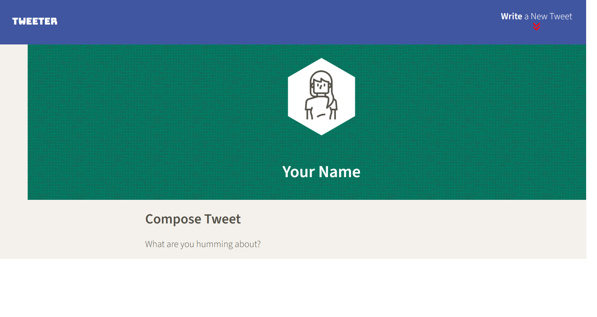
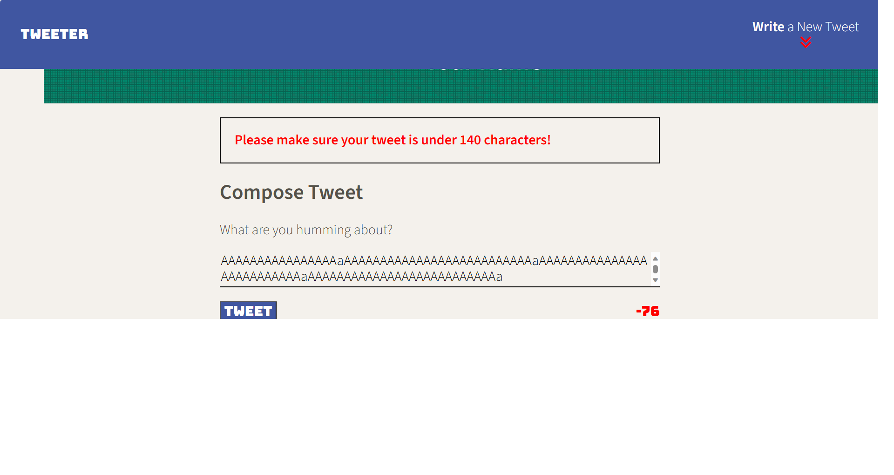
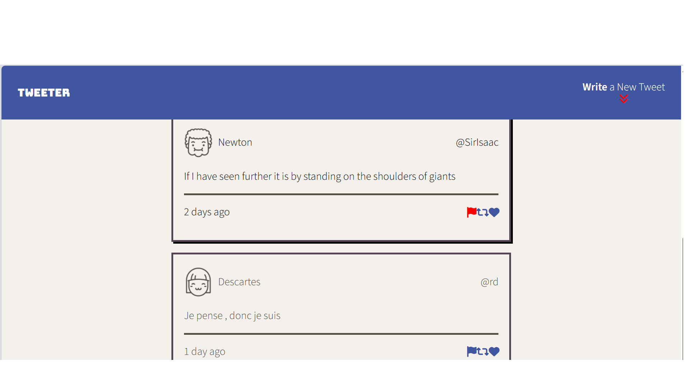

# Tweeter Project

Tweeter is a simple, single-page Twitter clone.

## Tweeter in Action

 

## Stacks

This project uses HTML, CSS, JS, jQuery and AJAX on the front-end and  Node and Express on the back-end

## Features

- Can post tweets as long as it is not blank or over 140 charactes
- Can review previous tweets posted sorted by most recent
- Responsive design if not viewing on a desktop

## Getting Started

1. [Create](https://docs.github.com/en/repositories/creating-and-managing-repositories/creating-a-repository-from-a-template) a new repository using this repository as a template.
2. Clone your repository onto your local device.
3. Install dependencies using the `npm install` command.
3. Start the web server using the `npm run local` command. The app will be served at <http://localhost:8080/>.
4. Go to <http://localhost:8080/> in your browser.

## Dependencies

- Express
- Node 5.10.x or above
